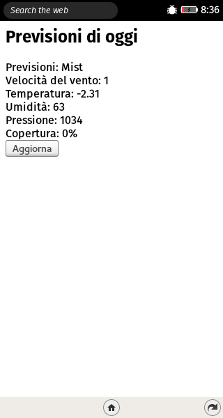

# Meteo
Grazie a questa app potrai ricevere le previsioni del tempo di [OpenWeatherMap.org](http://openweathermap.org).


### Screenshot


## Info
Difficoltà: 1.  
Tempo di sviluppo: 15 minuti.  
Tecnologie e API utilizzate:
* REST API
* AJAX e XHR
* JSON

### Specifiche
L'app permetterà premendo un pulsante di visualizzare le previoni del tempo aggiornate in una città preimpostata.

### Prerequisiti
Il servizio meteo che utilizzeremo necessita di una "chiave" detta *AppKey* per funzionare. Per prima cosa è quindi necessario registrarsi su OpenWeatherMap.org per ottenerla.  
**NOTA**: la chiave è una sequenza di numeri e lettere.

## Carta d'identità
Il manifest della nostra app è molto semplice e ridotto all'osso:
```
{
  "name": "Meteo",
  "description": "Scarica il meteo della tua città",
  "launch_path": "/index.html"
}
```

## La struttura
All'interno del file ``index.html`` creiamo una pagina simile alle precedenti, inserendo il bottone che richiamerà le previsioni e un contenitore in cui mostrarle.

```
<html>
  <head>
    <title>Meteo</title>
    <meta charset="utf-8">
  </head>
  <body>
    <h2>Previsioni di oggi</h2>
    <div id='display'></div>
    <button id='press-me'>Aggiorna</button>
    <script src="app.js"></script>
  </body>
</html>
```

## La logica dell'applicazione
La logica è contenuta nel file ``app.js``, come negli esempi precedenti mettiamo il nostro bottone in ascolto del *click* dell'utente.
```
var button = document.getElementById("press-me");
var display = document.getElementById("display");
button.addEventListener('click', prendiPrevisioni);
```
Nel momento in cui l'utente preme *Aggiorna* il contenitore viene riempito delle informazioni aggiornate. Queste informazioni sono ottenute collegandosi alle **REST API** fornite da OpenWeatherMap.
definiamo quindi la funzione``prendiPrevisioni()``.
```
function prendiPrevisioni(){
  var richiesta = new XMLHttpRequest();
  richiesta.open("GET", "http://api.openweathermap.org/data/2.5/weather?q=Vimercate&appid=INSERISCI_QUI_LA_TUA_APP_KEY&units=metric", true);
  richiesta.addEventListener("load",function(){
    var risp = JSON.parse(richiesta.responseText);
    display.innerHTML = "Previsioni: "+risp.weather[0].main+"<br>";
    display.innerHTML += "Velocità del vento: "+risp.wind.speed+"</br>";
    display.innerHTML += "Temperatura: "+risp.main.temp+"</br>";
    display.innerHTML += "Umidità: "+risp.main.humidity+"</br>";
    display.innerHTML += "Pressione: "+risp.main.pressure+"</br>";
    display.innerHTML += "Copertura: "+risp.clouds.all+"%</br>";
  })
  richiesta.send();
}
```
Per poterci collegare con OpenWeatherMap dobbiamo creare un oggetto che ci permetta di inviare richieste a un server, questo oggetto si chiama``XMLHttpRequest``(in breve ***xhr*** ).
quindi creiamo una variabile``richiesta`` a cui assegnare questo oggetto.
```
var richiesta = new XMLHttpRequest();
```
Ora dobbiamo impostare questa richiesta per collegarsi alle **REST API** di OpenWeatherMap. Per fare questo usiamo il metodo ``.open()``, che necessita di tre parametri:
* **String** tipo di richiesta - *GET* per ottenere dati, *POST* per inviarli a un server.
* **String** indirizzo a cui collegarsi (esempio: http://google.com)
* **Boolean** connessione asincrona.

Nel nostro caso impostiamo **GET** come tipo di richiesta, l'URL di OpenWeatherMap come indirizzo, e **true** per la connessione asincrona. Per ottenere l'indirizzo esatto guardiamo la documentazione delle **REST API** di *OWM*:  
l'indirizzo di base è ***http://api.openweathermap.org/data/2.5/weather*** a cui dobbiamo aggiungere i parametri necessari all'interno della query. I parametri in questione sono:
* **q** - Nome della città di cui si vogliono le previsioni.
* **appid** - La chiave che avete ottenuto dopo la registrazione.
* **units** - Permette di scegliere il set di unità di misura.

Quindi all'URL base aggiungiamo ``?q=Vimercate,it&appid=INSERISCI_LA_TUA_CHIAVE&units=metric`` ed abbiamo ottenuto l'URL completa. Per Verificare che la tua URL sia corretta inseriscila nel browser, se otterrai le previsioni allora sei sulla giusta strada, altrimenti ricontrolla bene i valori che hai inserito. Il comando da lanciare è:
```
richiesta.open("GET", "http://api.openweathermap.org/data/2.5/weather?q=Vimercate&appid=INSERISCI_QUI_LA_TUA_APP_KEY&units=metric", true);
```
Ora abbiamo configurato la richiesta, ma non l'abbiamo inviata, per farlo usiamo il metodo ``.send()``.

**ATTENZIONE:** Si tratta di una richesta asincrona, ossia di una funzione che riporterà un risposta, ma non nell'immediato. In poche parole grazie all'asincronia possiamo continuare a usare la nostra app mentre attendiamo i risultati dalla rete. Esempio di programmazione **NON ASINCRONA**: Su Office Word quando salvi un file il programma rimane bloccato fino al termine del salvataggio. Esempio di programmazione **ASINCRONA**: in Google Docs il file viene salvato ad ogni modifica, permettendo però di continuare a scrivere.

Detto questo, come possiamo sfruttare l'asincronia della XMLHttpRequest? semplicemente applichiamo un listener!
```
richiesta.addEventListener("load", function(){});
```
Ossia: quando la richiesta ha ricevuto una risposta esegui questa funzione. Visto che ora siamo sicuri di aver ottenuto una risposta, possiamo vederla tramite la proprietà ``.responseText``. Sapendo che si tratta di un **JSON Object** possiamo utilizzare una funzione che ricostruisca l'oggetto a partire dalla stringa.
```
var risp = JSON.parse(richiesta.responseText);
```
Questo ad esempio è il mio JSON Object:
```
{
    "coord":{
        "lon":9.46,
        "lat":45.58
    },
    "weather":[{
        "id":701,
        "main":"Mist",
        "description":"mist",
        "icon":"50n"
    }],
    "base":"cmc stations",
    "main":{
        "temp":271.45,
        "pressure":1035,
        "humidity":70,
        "temp_min":268.15,
        "temp_max":273.15
    },
    "wind":{
        "speed":3.1,
        "deg":360
    },
    "clouds":{
        "all":0
    },
    "dt":1453600794,
    "sys":{
        "type":1,
        "id":5794,
        "message":0.005,
        "country":"IT",
        "sunrise":1453618348,
        "sunset":1453652175
    },
    "id":6534467,
    "name":"Basiano",
    "cod":200
}
```
Il JSON è una mappa che associa a ogni chiave un valore, utilizzando quindi le chiavi posso ottenere i dati desiderati. Avendolo salvato nella variabile ``risp`` posso ottenere la temperatura minima accedendo a ``risp.main.temp_min``, oppure la previsione visitando ``risp.weather[0].main``.

Non ci resta che mostrare sulla pagina i risultati ottenuti, per farlo concateniamo le stringhe di testo con i nostri valori.
```
    display.innerHTML = "Previsioni: "+risp.weather[0].main+"<br>";
    display.innerHTML += "Velocità del vento: "+risp.wind.speed+"</br>";
    display.innerHTML += "Temperatura: "+risp.main.temp+"</br>";
    display.innerHTML += "Umidità: "+risp.main.humidity+"</br>";
    display.innerHTML += "Pressione: "+risp.main.pressure+"</br>";
    display.innerHTML += "Copertura: "+risp.clouds.all+"%</br>";
    ```
Per concludere lanciamo la funzione ``prendiPrevisioni()`` così che all'avvio siano mostrate subito le previsioni.

### Esercizi
* Aggiungi un input che permetta all'utente di decidere il luogo di cui vuole le previsioni.
* Migliora l'interfaccia grafica aggiungendo le icone specifiche per ogni tipo di previsione.
* Permetti all'utente di visualizzare le previsioni non solo del giorno corrente, ma anche dei successivi giorni.
* Ottieni le previsioni per la posizione corrente utilizzando la geolocazione.
